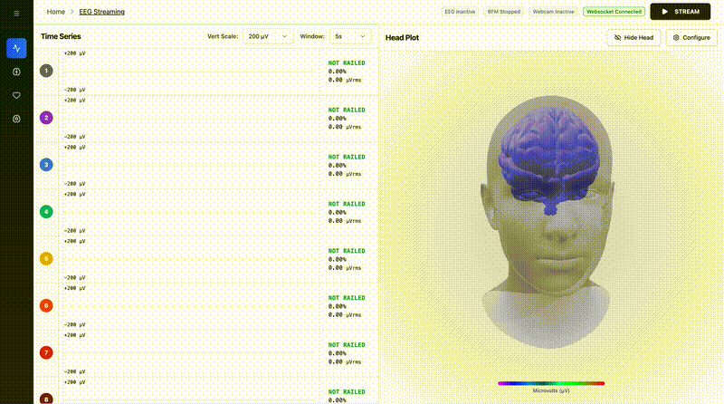
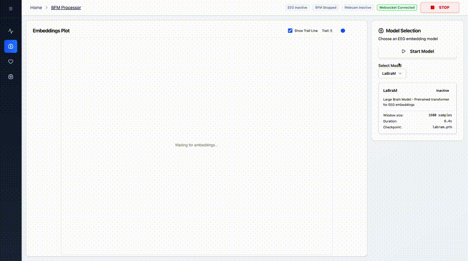
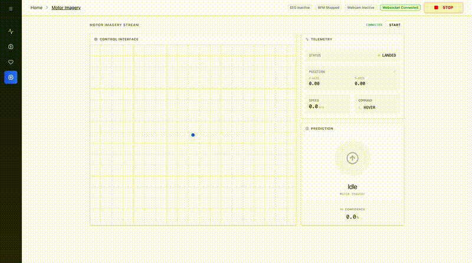

<a id="readme-top"></a>

<div align="center">
  
  <h1 align="center">
    <a href="https://en.wiktionary.org/wiki/thonk" target="_blank">
      Thonk
    </a>
  </h1>

  <p align="center">
    A comprehensive Brain-Computer Interface (BCI) platform for real-time EEG streaming, motor imagery classification and ocular feature extraction (pupillometry & rPPG).
  </p>
</div>

<!-- INFO ALERTS/SHIELDS -->
<div align="center">
  
[](https://opensource.org/licenses/MIT)
[](https://www.python.org/downloads/)
[](https://nodejs.org/)

</div>

<!-- TABLE OF CONTENTS -->
<details>
  <summary>Table of Contents</summary>
  <ol>
    <li>
      <a href="#about-the-project">About The Project</a>
      <ul>
        <li><a href="#project-structure">Project Structure</a></li>
        <li><a href="#documentation">Documentation</a></li>
      </ul>
    </li>
    <li><a href="#features--demonstrations">Features & Demonstrations</a></li>
    <li>
      <a href="#getting-started">Getting Started</a>
      <ul>
        <li><a href="#prerequisites">Prerequisites</a></li>
        <li><a href="#installation">Installation</a></li>
      </ul>
    </li>
    <li><a href="#usage">Usage</a></li>
    <li><a href="#license">License</a></li>
    <li><a href="#acknowledgments">Acknowledgments</a></li>
  </ol>
</details>

<!-- ABOUT THE PROJECT -->

## About **Thonk** 🧠

### Project Structure

The repository is modularly structured into the following main components:

- **`backend/`** – A FastAPI streaming server and processing engine for BCI and webcam data.
- **`frontend/`** – A React + Vite based real-time visualization dashboard.
- **`docs/`** – Supplementary project documentation and algorithmic explanations.

### Documentation

For more in-depth explanations of specific modules within the codebase, refer to our detailed markdown documentation:

- **[EEG Math & Processing](docs/eeg/EEG_MATH.md)**: Details on channel statistics, constraints, and signal filtering.
- **[Motor Imagery](docs/eeg/mi.md)**: Explanation of the EEG classification pipeline and Motor Imagery foundations.
- **[rPPG Implementation](docs/webcam/rppg.md)**: Details on remote photoplethysmography algorithms used for heartbeat and SPO2 detection.
- **[Ocular Features](docs/webcam/ocular.md)**: Details on pupillometry, blink detection, and eye segmentation using `meye`.

<!-- FEATURES & DEMONSTRATIONS -->

## Features & Demonstrations

See Thonk in action! Below are video demonstrations of the platform's key features:

### EEG Streaming

Real-time EEG data visualization with channel mapping and 3D brain rendering.



### BFM Embeddings

LaBraM foundation model generating real-time EEG embeddings for downstream tasks.



### Webcam Features

Simultaneous rPPG (heart rate & SpO2) and pupillometry extraction from webcam input.


### Motor Imagery

Real-time motor imagery classification and control interface with live predictions.



<!-- GETTING STARTED -->

## Getting Started

### Prerequisites

**Git Submodules**

This project uses [Git submodules](https://git-scm.com/book/en/v2/Git-Tools-Submodules) to include external dependencies. When you clone the repository for the first time, you need to initialize and update the submodules to fetch the external code:

```bash
git submodule update --init --recursive
```

This ensures all referenced external libraries are properly downloaded and available in your local workspace.

**OpenBCI Cyton Board**

This project uses the [OpenBCI Cyton Board](https://shop.openbci.com/products/cyton-biosensing-board-8-channel), a 8-channel EEG acquisition device. The board streams brainwave data via USB dongle to the backend server.

### 1. Hardware

Prepare the **OpenBCI Cyton Board** (set to PC Mode, there should be a blue light) and electrodes.
Connect the USB Dongle to your laptop (there should be a blue light on the dongle).

### 2. Backend

The project requires Python 3.12 for the backend, managed via `uv`.

**Step A: `.env` file**
Create the environment file:

```bash
cp backend/.env.example backend/.env
```

**Step B: Starting the server**

```bash
cd backend
uv sync
source .venv/bin/activate
python app.py
```

### 3. Frontend

You need `bun` or `npm` installed for frontend package management.

**Step A: `.env` file**
Create the environment file:

```bash
cp frontend/.env.example frontend/.env
```

**Step B: Run frontend**

```bash
cd frontend
bun install  # or npm install
bun dev      # or npm run dev
```

Navigate to [http://localhost:5173](http://localhost:5173).

### 4. Tauri (Desktop App)

This project is also configured as a **Tauri desktop application**, which packages the frontend and automatically spawns the backend process as a native macOS/Windows/Linux app.

**Development Mode**

```bash
cd frontend
npm run tauri:dev
```

This will:
1. Start the Vite dev server
2. Build the Rust backend
3. Launch the Tauri desktop app
4. Automatically spawn the Python backend

**Production Build**

```bash
cd frontend
npm run tauri:build
```

Creates a native executable in:
- **macOS**: `frontend/src-tauri/target/release/bundle/dmg/thonk_*.dmg`
- **Windows**: `frontend/src-tauri/target/release/bundle/msi/thonk_*.msi`
- **Linux**: `frontend/src-tauri/target/release/bundle/appimage/thonk_*.AppImage`

### 5. Test

Verify the following functionality to ensure the setup is successful:

- **EEG Streaming**
  - EEG data is being streamed on the time series chart.
  - EEG channels can be mapped to electrodes on the headplot.
  - The 3D brain changes colors as data is streamed and a channel is mapped to an electrode.
- **BFM**
  - The LaBraM model is able to generate embeddings _(this takes some time to collect an initial buffer, so give it a while)_.
- **Webcam**
  - Displays rPPG data in real-time.
  - Displays pupillometry data (pupil diameters) in real-time.
- **Motor Imagery**
  - As EEG data is being streamed, dot on the control interface and corresponding data should be displayed/updated in real-time.

<!-- LICENSE -->

## License

Distributed under the MIT License. See [LICENSE](LICENSE) for more information.

<!-- ACKNOWLEDGMENTS -->

## Acknowledgments

This project utilizes several open-source tools and resources:

- [NeuralFlight](https://github.com/dronefreak/NeuralFlight) for motor imagery foundations.
- [OpenBCI](https://openbci.com/) for the core EEG hardware and streaming interfaces.
- [rPPG-Toolbox](https://github.com/ubicomplab/rPPG-Toolbox) for remote photoplethysmography algorithms.
- [meye](https://github.com/fabiocarrara/meye) for efficient eye segmentation and pupillometry.
- [LaBraM](https://github.com/935963004/LaBraM) for EEG foundation model embeddings.
- Various research papers in the fields of BCI, computer vision, and cognitive state.


<p align="right">(<a href="#readme-top">back to top</a>)</p>
